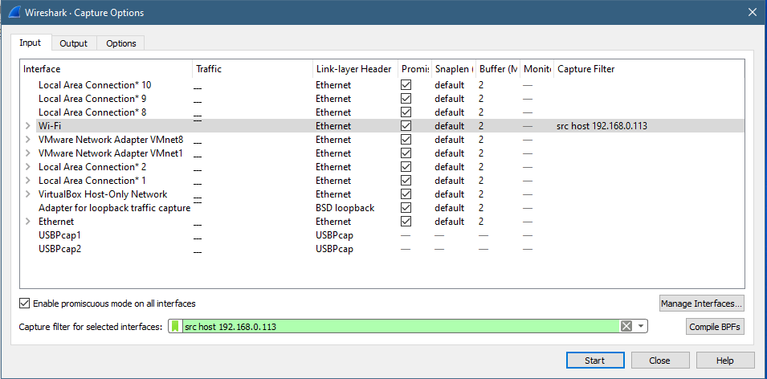

# Jarkom-Modul-1-D01-2021

## Soal 1


## Soal 6
Diminta untuk mencari username dan password ketika melakukan login ke FTP Server <br>
Maka filternya adalah
```
ftp.request.command == "USER" || ftp.request.command == "PASS"
```
seperti berikut


Dan didapatkan username serta password sebagai berikut
```
Username : secretuser
```
```
Password : aku.pengen.pw.aja
```

## Soal 7
Ada 500 file zip yang disimpan ke FTP Server. Diminta untuk menyimpan dan membuka file pdf.(Hint = nama pdf-nya "Real.pdf") <br>
Adapun step nya adalah sebagai berikut <br>
1. Masukkan filter 
```
ftp-data contains “Real.pdf”
```


<br>
2. Lalu klik kanan pada hasil yang paling atas setelah itu klik Follow lalu TCP Scream <br>

<br>
3. Lalu ubah Show Data As menjadi Raw

<br>
4. Lalu klik save as Real.pdf

<br>
Berikut ini merupakan isi dari Real.pdf<br>


## Soal 8
Diminta untuk mencari paket yang menunjukkan pengambilan dari file FTP tersebut. <br>
Karena perintahnya merupakan pengambilan maka memakai filter **RETR** <br>
Berikut ini adalah filternya
```
  ftp contains “RETR”
```


## Soal 9
Dari paket-paket yang menuju FTP terdapat indikasi penyimpanan beberapa file. <br>
Salah satunya adalah sebuah file berisi data rahasia dengan nama "secret.zip". <br>
Simpan dan buka file tersebut!

 1. Maka kita memerlukan filter untuk menemukan file secret.zip tersebut dengan memasukkan filter sebagai berikut
```
 ftp-data.command == "STOR secret.zip"
```


  2.Lalu klik kanan menuju `Follow lalu TCP Scream`
  
  3. Setelah itu ubah Show Data > Raw
   
  <br>
  4. Lalu simpan file tersebut dengan nama "secret.zip" <br>
    
  <br>
  5. Maka berikut, ini merupakan tampilan isi dari file "secret.zip" yang memerlukan password untuk membukanya <br>
 

## Soal 10
Selain itu terdapat "history.txt" yang kemungkinan berisi history bash server tersebut! <br>
Gunakan isi dari "history.txt" untuk menemukan password untuk membuka file rahasia yang ada di "secret.zip"! <br>
1.
  Maka untuk membuka dan mencari password tersebut, maka digunakan filter sebagai berikut
 ```
   ftp-data.command == "STOR history.txt"
 ```
  
<br>
2.
  Lalu pada history bash dari history.txt terdapat file `bukanapaapa.txt` yang menunjukkan bahwa file tersebut merupakan passwordnya. <br>
  Untuk mendapatkan file tersebut maka filternya adalah :
 ```
   ftp-data.command == "STOR bukanapaapa.txt"
 ```
  
 <br>
3.
  Lalu klik kanan menuju `Follow lalu TCP Scream`
  

 4.
  Setelah itu ubah Show Data > Raw <br>
  
 
5. Setelah itu simpan file bernama history.txt


6. Berikut ini merupakan isi dari history.txt, yang merupakan password untuk membuka file secret.zip.


7. Berikut ini merupakan isi dari file Wanted.pdf

  
  
  
## Soal 11
Diminta untuk menfilter sehingga wireshark hanya mengambil paket yang berasal dari "port 80!".<br><br>
Step : Ketik `src port 80` pada filter di wireshark.


Catatan : untuk hasil dari `port 80` yaitu berupa kosongan dikarenakan pada port tersebut tidak terjadinya protokol `http` yang berjalan.

## Soal 12
Diminta untuk menfilter sehingga wireshark hanya mengambil paket yang mengandung "port 21!".<br><br>
Step : Ketik `port 21` pada filter di wireshark.


## Soal 13
Diminta untuk menfilter sehingga wireshark hanya menampilkan paket yang menuju "port 443!".<br><br>
Step : Ketik `dst port 443` pada filter di wireshark.


## Soal 14
Diminta untuk menfilter sehingga wireshark hanya mengambil paket yang tujuannya ke "kemenag.go.id!".<br><br>
Step : Ketik `dst host kemenag.go.id` pada filter di wireshark.


Catatan : untuk menjalankan filter `dst host kemenag.go.id`, jangan lupa untuk membuka juga website dari "kemenag.go.id". Jika tidak,
maka program tidak berjalan atau paket yang akan diambil masih berupa kosongan.

## Soal 15
Diminta untuk menfilter sehingga wireshark hanya mengambil paket yang berasal dari "ip kalian!".<br><br>
Step :
1. Buka "Command Prompt" dan ketik `ipconfig`


2. Copy "ip address" pada `IPv4 Address : 192.168.0.113` pada `ipconfig`, dan paste ke filter expression pada wireshark dengan command `src host 192.168.0.113`.



Catatan : Untuk pengambilan "ip address" disesuaikan dengan "ip address" sendiri.
