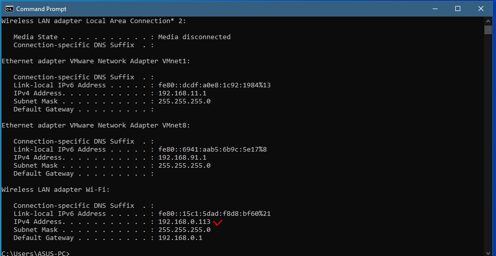

# Jarkom-Modul-1-D01-2021

## Soal 1


## Soal 6
Diminta untuk mencari username dan password ketika melakukan login ke FTP Server <br>
Maka filternya adalah
```
ftp.request.command == "USER" || ftp.request.command == "PASS"
```
seperti berikut


Dan didapatkan username serta password sebagai berikut
```
Username : secretuser
```
```
Password : aku.pengen.pw.aja
```

## Soal 7
Ada 500 file zip yang disimpan ke FTP Server. Diminta untuk menyimpan dan membuka file pdf.(Hint = nama pdf-nya "Real.pdf")
Adapun step nya adalah sebagai berikut
1. Masukkan filter 
```
ftp-data contains “Real.pdf”
```


<br>
2. Lalu klik kanan pada hasil yang paling atas setelah itu klik `Follow lalu TCP Scream`

<br>
3. Lalu ubah `Show Data As menjadi Raw`

<br>
4. Lalu klik save as `Real.pdf`

<br>
Berikut ini merupakan isi dari `Real.pdf`


## Soal 11
Diminta untuk menfilter sehingga wireshark hanya mengambil paket yang berasal dari "port 80!".<br><br>
Step : Ketik `src port 80` pada filter di wireshark.


Catatan : untuk hasil dari `port 80` yaitu berupa kosongan dikarenakan pada port tersebut tidak terjadinya protokol `http` yang berjalan.

## Soal 12
Diminta untuk menfilter sehingga wireshark hanya mengambil paket yang mengandung "port 21!".<br><br>
Step : Ketik `port 21` pada filter di wireshark.


## Soal 13
Diminta untuk menfilter sehingga wireshark hanya menampilkan paket yang menuju "port 443!".<br><br>
Step : Ketik `dst port 443` pada filter di wireshark.


## Soal 14
Diminta untuk menfilter sehingga wireshark hanya mengambil paket yang tujuannya ke "kemenag.go.id!".<br><br>
Step : Ketik `dst host kemenag.go.id` pada filter di wireshark.


Catatan : untuk menjalankan filter `dst host kemenag.go.id`, jangan lupa untuk membuka juga website dari "kemenag.go.id". Jika tidak,
maka program tidak berjalan atau paket yang akan diambil masih berupa kosongan.

## Soal 15
Diminta untuk menfilter sehingga wireshark hanya mengambil paket yang berasal dari "ip kalian!".<br><br>
Step :
1. Buka "Command Prompt" dan ketik `ipconfig`



2. Copy "ip address" pada `IPv4 Address : 192.168.0.113` pada `ipconfig`, dan paste ke filter expression pada wireshark dengan command `src host 192.168.0.113`.


Catatan : Untuk pengambilan "ip address" disesuaikan dengan "ip address" sendiri.
